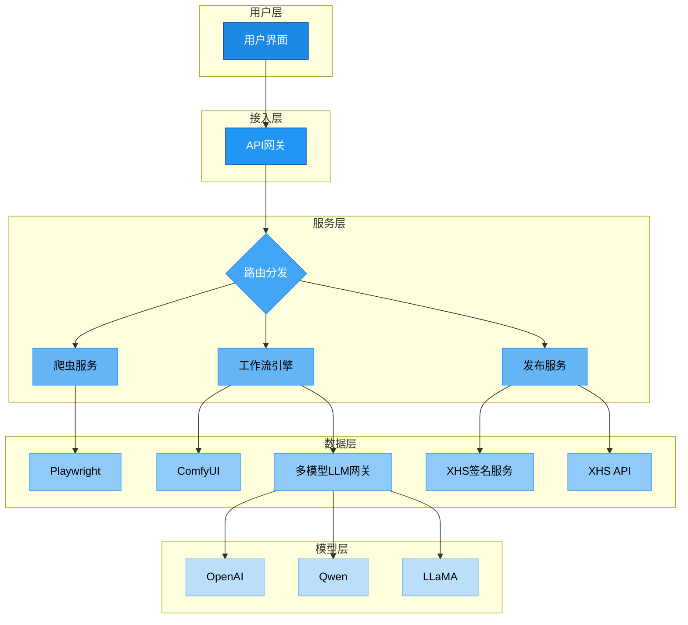

# AI 自动化工作台 (MediaWorkbench)


## 📖 项目简介

MediaWorkbench 是一个基于 AI 的多媒体内容自动化创作与发布工具，集成了图文内容生成和自动化发布功能。该工具旨在帮助创作者提高内容创作效率，通过 AI 技术实现内容的智能生成和管理。

## 🌟 主要功能

### 🤖 AI 内容生成
- 基于GPT智能生成创作灵感
- 智能文案生成与翻译
- 支持自定义工作流
- 支持工作流生成内容
- 支持工作流管理
- 支持智能生成小红书文案
- 支持小红书一键发布图文内容

### 📱 自动化发布（未支持）
- 后续支持内容的自动化生成与发布
- 图文笔记管理
- 定时发布功能

### 🎨 工作流管理
- 可视化工作流管理
- 自定义变量管理

## 🔧 技术架构



### 后端技术栈
- Python 3.8+
- Flask
- SQLAlchemy
- ComfyUI API

### 前端技术栈
- Vue 3
- TypeScript
- Naive UI
- Vite
- Vue Router
- Axios

## 🚀 快速开始

### 环境要求
- Python 3.8+
- Node.js >= 16.0.0
- npm >= 7.0.0
- ComfyUI 环境

### 安装步骤

1. 克隆项目
```bash
git clone https://github.com/yourusername/xhs-automate.git
cd xhs-automate
```

2. 后端设置
```bash
cd backend
pip install -r requirements.txt
cp .env.example .env
# 编辑 .env 文件配置必要的环境变量
python app.py
```

3. 前端设置
```bash
cd frontend
npm install
npm run dev
```

## 📝 配置说明

### 后端配置（.env 文件）
- `COMFYUI_API_URL`: ComfyUI 服务地址
- `XHS_COOKIE`: 小红书登录凭证
- `DATABASE_URI`: 数据库连接 URI

### 前端配置
- 在 `frontend/.env` 文件中配置后端 API 地址

## 📚 项目结构

```
xhs-automate/
├── backend/
│   ├── app/            # Flask 应用
│   ├── comfyui_api/    # ComfyUI 接口
│   ├── spider/         # 爬虫模块
│   ├── translate/      # 翻译服务
│   └── xhs_upload/     # 上传模块
├── frontend/
│   ├── src/
│   │   ├── api/       # API 接口
│   │   ├── components/# Vue 组件
│   │   ├── views/     # 页面视图
│   │   ├── router/    # 路由配置
│   │   └── styles/    # 样式文件
│   └── public/        # 静态资源
```

## ⚠️ 免责声明

1. 本项目仅供学习和研究使用，禁止用于商业用途。

2. 使用本工具过程中产生的所有内容和行为，需符合小红书平台的相关规则和条款。

3. 本工具不会收集或存储任何用户的个人信息或账号数据。

4. 使用本工具时应遵守相关法律法规，不得用于任何违法或不当用途。

5. 项目开发者不承担任何因使用本工具而导致的直接或间接损失。

## 🙏 致谢

本项目的开发过程中使用了以下优秀的开源项目，在此特别感谢：

- [xhs](https://github.com/ReaJason/xhs) - 提供了小红书接口的基础实现
- [comfyui-api](https://github.com/9elements/comfyui-api) - 提供了 ComfyUI 的 API 封装

## 📄 许可证

本项目采用 MIT 许可证。详见 [LICENSE](LICENSE) 文件。

## 🤝 贡献指南

欢迎提交 Issue 和 Pull Request 来帮助改进项目。在提交之前，请确保：

1. Fork 本仓库
2. 创建特性分支 (git checkout -b feature/AmazingFeature)
3. 提交更改 (git commit -m 'Add some AmazingFeature')
4. 推送到分支 (git push origin feature/AmazingFeature)
5. 开启 Pull Request

## 📮 联系方式

如有任何问题或建议，欢迎通过以下方式联系：

- 提交 Issue
- 发送邮件至：[xu20151211@gmail.com]
- 入群交流：

    
---

**注意**：使用本工具时请遵守相关平台规则和法律法规，合理使用自动化功能。